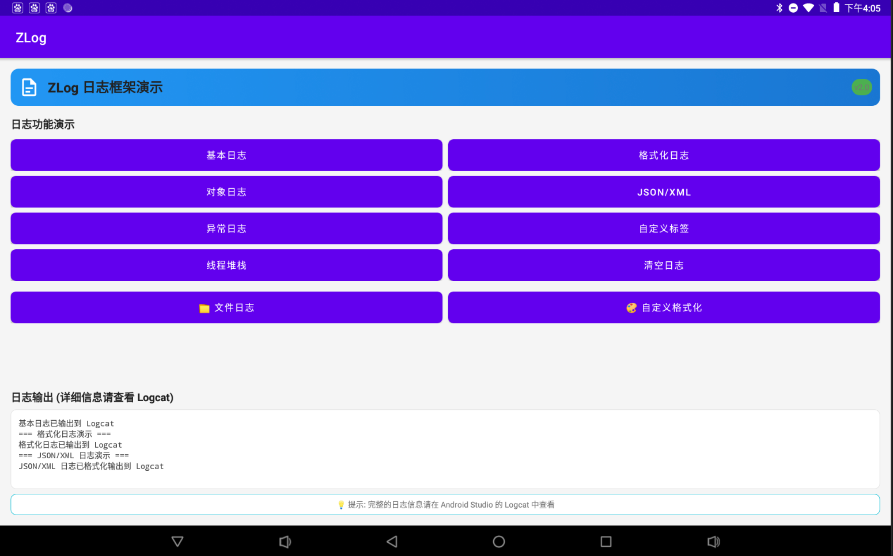
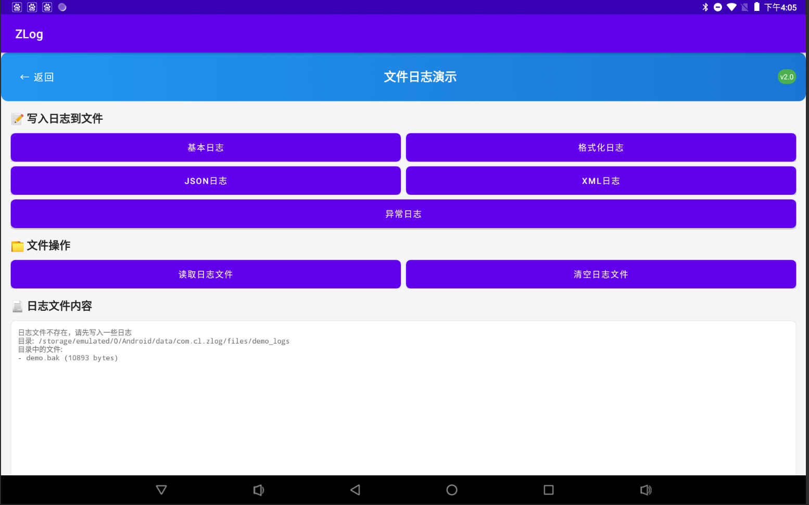

# ZLog 使用指南

ZLog 是一个功能强大、灵活易用的 Android/Java 日志框架，支持多种输出方式，包括控制台、文件、远程服务器等。本文档将详细介绍如何使用 ZLog 框架。

## 📱 应用截图

<div align="center">

### 主界面


### 日志输出效果


*更多截图展示了 ZLog 在不同场景下的使用效果，包括基本日志、格式化日志、文件日志等功能。*

</div>

## 目录

- [📱 应用截图](#-应用截图)
- [快速开始](#快速开始)
- [基本使用](#基本使用)
- [高级配置](#高级配置)
- [日志输出器](#日志输出器)
- [自定义格式化器](#自定义格式化器)
- [拦截器](#拦截器)
- [最佳实践](#最佳实践)
- [📋 版本日志](#-版本日志)

## 快速开始

### 1. 添加依赖

在你的 `build.gradle` 文件中添加 ZLog 依赖：

```gradle
dependencies {
      implementation 'com.github.cl-6666:ZLog:v2.0.0'
}
```

### 2. 初始化

在 `Application` 类中初始化 ZLog：

```kotlin
class MyApplication : Application() {
    override fun onCreate() {
        super.onCreate()
        
        // 简单初始化
        ZLog.init()
        
        // 或者使用自定义配置
        val config = LogConfiguration.Builder()
            .logLevel(LogLevel.ALL)
            .tag("MyApp")
            .build()
        ZLog.init(config)
    }
}
```

### 3. 开始使用

```kotlin
// 基本日志输出
ZLog.d("这是一条调试信息")
ZLog.i("这是一条信息")
ZLog.w("这是一条警告")
ZLog.e("这是一条错误")

// 格式化输出
ZLog.d("用户ID: %d, 用户名: %s", 123, "张三")

// 输出对象
val user = User("张三", 25)
ZLog.d(user)

// 输出异常
try {
    // 一些可能出错的代码
} catch (e: Exception) {
    ZLog.e("发生异常", e)
}
```

## 基本使用

### 日志级别

ZLog 支持以下日志级别：

```kotlin
ZLog.v("VERBOSE 级别日志")  // 详细信息
ZLog.d("DEBUG 级别日志")    // 调试信息
ZLog.i("INFO 级别日志")     // 一般信息
ZLog.w("WARN 级别日志")     // 警告信息
ZLog.e("ERROR 级别日志")    // 错误信息
```

### 格式化输出

```kotlin
// 使用 String.format 风格的格式化
ZLog.d("用户 %s 的年龄是 %d 岁", "张三", 25)

// 输出数组
val array = arrayOf("苹果", "香蕉", "橙子")
ZLog.d(array)

// 输出任意对象
val user = User("张三", 25, "zhangsan@example.com")
ZLog.d(user)
```

### JSON 和 XML 输出

```kotlin
// 输出 JSON 字符串（自动格式化）
val jsonString = """{"name":"张三","age":25}"""
ZLog.json(jsonString)

// 输出 XML 字符串（自动格式化）
val xmlString = "<user><name>张三</name><age>25</age></user>"
ZLog.xml(xmlString)
```

## 高级配置

### 完整配置示例

```kotlin
val config = LogConfiguration.Builder()
    .logLevel(LogLevel.DEBUG)                    // 设置日志级别
    .tag("MyApp")                               // 设置全局标签
    .enableThreadInfo()                         // 启用线程信息
    .enableStackTrace(2)                        // 启用堆栈跟踪，深度为2
    .enableBorder()                             // 启用边框美化
    .addObjectFormatter(User::class.java,       // 自定义对象格式化器
        UserObjectFormatter())
    .addInterceptor(                            // 添加拦截器
        BlacklistTagsFilterInterceptor("SENSITIVE"))
    .build()

ZLog.init(config)
```

### 动态配置

ZLog 支持在运行时动态修改配置：

```kotlin
// 临时修改标签
ZLog.tag("CustomTag").d("这条日志使用自定义标签")

// 临时启用线程信息
ZLog.enableThreadInfo().d("显示线程信息的日志")

// 临时启用堆栈跟踪
ZLog.enableStackTrace(3).d("显示堆栈跟踪的日志")

// 临时启用边框
ZLog.enableBorder().d("带边框的日志")

// 链式调用
ZLog.tag("API")
    .enableThreadInfo()
    .enableBorder()
    .d("API 调用成功")
```

## 日志输出器

ZLog 支持多种日志输出器，可以同时输出到多个目标。

### AndroidPrinter

输出到 Android Logcat：

```kotlin
val androidPrinter = AndroidPrinter(true) // 参数表示是否自动分行
ZLog.init(config, androidPrinter)
```

### ConsolePrinter

输出到控制台：

```kotlin
val consolePrinter = ConsolePrinter()
ZLog.init(config, consolePrinter)
```

### FilePrinter

输出到文件：

```kotlin
val filePrinter = FilePrinter.Builder("/sdcard/logs")
    .fileNameGenerator(DateFileNameGenerator())        // 按日期生成文件名
    .backupStrategy(NeverBackupStrategy())            // 备份策略
    .cleanStrategy(FileLastModifiedCleanStrategy(     // 清理策略
        7 * 24 * 60 * 60 * 1000L))                  // 保留7天
    .build()

ZLog.init(config, filePrinter)
```

### 多输出器组合

```kotlin
val androidPrinter = AndroidPrinter()
val consolePrinter = ConsolePrinter()
val filePrinter = FilePrinter.Builder("/sdcard/logs").build()

// 同时输出到多个目标
ZLog.init(config, androidPrinter, consolePrinter, filePrinter)
```

## 自定义格式化器

### 对象格式化器

```kotlin
class User(val name: String, val age: Int, val email: String)

class UserObjectFormatter : ObjectFormatter<User> {
    override fun format(user: User): String {
        return "User{name='${user.name}', age=${user.age}, email='${user.email}'}"
    }
}

// 注册自定义格式化器
val config = LogConfiguration.Builder()
    .addObjectFormatter(User::class.java, UserObjectFormatter())
    .build()
```

### 其他格式化器

```kotlin
val config = LogConfiguration.Builder()
    .threadFormatter(CustomThreadFormatter())      // 自定义线程格式化器
    .stackTraceFormatter(CustomStackTraceFormatter()) // 自定义堆栈格式化器
    .borderFormatter(CustomBorderFormatter())      // 自定义边框格式化器
    .jsonFormatter(CustomJsonFormatter())          // 自定义JSON格式化器
    .xmlFormatter(CustomXmlFormatter())            // 自定义XML格式化器
    .throwableFormatter(CustomThrowableFormatter()) // 自定义异常格式化器
    .build()
```

## 拦截器

拦截器可以在日志输出前对日志进行处理或过滤。

### 黑名单标签过滤器

```kotlin
val interceptor = BlacklistTagsFilterInterceptor("SENSITIVE", "PASSWORD", "TOKEN")

val config = LogConfiguration.Builder()
    .addInterceptor(interceptor)
    .build()
```

### 自定义拦截器

```kotlin
class CustomInterceptor : Interceptor {
    override fun intercept(logLevel: Int, tag: String?, msg: String?): LogItem? {
        // 在这里可以修改或过滤日志
        if (msg?.contains("敏感信息") == true) {
            return null // 返回 null 表示不输出这条日志
        }
        
        // 修改日志内容
        val newMsg = msg?.replace("密码", "***")
        return LogItem(logLevel, tag, newMsg)
    }
}

val config = LogConfiguration.Builder()
    .addInterceptor(CustomInterceptor())
    .build()
```

## 最佳实践

### 1. 在 Application 中初始化

```kotlin
class MyApplication : Application() {
    override fun onCreate() {
        super.onCreate()
        initZLog()
    }
    
    private fun initZLog() {
        val config = LogConfiguration.Builder()
            .logLevel(if (BuildConfig.DEBUG) LogLevel.ALL else LogLevel.WARN)
            .tag(getString(R.string.app_name))
            .enableThreadInfo()
            .enableStackTrace(2)
            .enableBorder()
            .build()
            
        val printers = mutableListOf<Printer>()
        
        // 添加 Android 打印器
        printers.add(AndroidPrinter())
        
        // Debug 模式下添加控制台打印器
        if (BuildConfig.DEBUG) {
            printers.add(ConsolePrinter())
        }
        
        // 添加文件打印器
        val logDir = File(getExternalFilesDir(null), "logs")
        val filePrinter = FilePrinter.Builder(logDir.absolutePath)
            .fileNameGenerator(DateFileNameGenerator())
            .cleanStrategy(FileLastModifiedCleanStrategy(7 * 24 * 60 * 60 * 1000L))
            .build()
        printers.add(filePrinter)
        
        ZLog.init(config, *printers.toTypedArray())
        
        ZLog.i("ZLog 初始化完成")
    }
}
```

### 2. 使用包装类

```kotlin
object Logger {
    fun d(msg: String) = ZLog.d(msg)
    fun d(format: String, vararg args: Any?) = ZLog.d(format, *args)
    fun i(msg: String) = ZLog.i(msg)
    fun w(msg: String) = ZLog.w(msg)
    fun e(msg: String, throwable: Throwable? = null) {
        if (throwable != null) {
            ZLog.e(msg, throwable)
        } else {
            ZLog.e(msg)
        }
    }
    
    // 网络请求日志
    fun api(url: String, response: String) {
        ZLog.tag("API").d("URL: %s\nResponse: %s", url, response)
    }
    
    // 数据库操作日志
    fun db(operation: String, table: String) {
        ZLog.tag("DB").d("Operation: %s, Table: %s", operation, table)
    }
}
```

### 3. 性能考虑

```kotlin
// 避免在循环中频繁输出日志
for (i in 0..1000) {
    // 不好的做法
    // ZLog.d("处理第 %d 项", i)
}

// 更好的做法
ZLog.d("开始处理 1000 项数据")
for (i in 0..1000) {
    // 处理逻辑
    if (i % 100 == 0) {
        ZLog.d("已处理 %d 项", i)
    }
}
ZLog.d("处理完成")
```

### 4. 日志级别管理

```kotlin
// 根据构建类型设置不同的日志级别
val logLevel = when {
    BuildConfig.DEBUG -> LogLevel.ALL
    BuildConfig.BUILD_TYPE == "staging" -> LogLevel.INFO
    else -> LogLevel.WARN
}

val config = LogConfiguration.Builder()
    .logLevel(logLevel)
    .build()
```

### 5. 敏感信息处理

```kotlin
// 使用拦截器过滤敏感信息
class SensitiveInfoInterceptor : Interceptor {
    private val sensitivePatterns = listOf(
        "password=\\w+".toRegex(),
        "token=\\w+".toRegex(),
        "\\d{11}".toRegex() // 手机号
    )
    
    override fun intercept(logLevel: Int, tag: String?, msg: String?): LogItem? {
        var filteredMsg = msg
        sensitivePatterns.forEach { pattern ->
            filteredMsg = filteredMsg?.replace(pattern, "***")
        }
        return LogItem(logLevel, tag, filteredMsg)
    }
}
```

## 总结

ZLog 是一个功能丰富、高度可定制的日志框架。通过合理的配置和使用，可以大大提高开发和调试效率。记住以下要点：

1. 在 Application 中进行初始化
2. 根据构建类型设置合适的日志级别
3. 使用多种输出器满足不同需求
4. 利用拦截器处理敏感信息
5. 注意性能，避免过度日志输出
6. 使用自定义格式化器提高日志可读性

更多详细信息请参考源码和示例项目。

## 📋 版本日志

### v2.1.0 (2025-09-15)
**🎉 新功能**
- ✨ 优化时间戳显示格式，从数字时间戳改为年月日时分秒格式 (yyyy-MM-dd HH:mm:ss)
- ✨ 完成 Java 到 Kotlin 的全面转换，提升代码现代化程度
- 📝 新增详细的中文使用指南文档

**🐛 修复**
- 🔧 修复 Java/Kotlin 互操作性问题
- 🔧 解决编译时的访问控制问题
- 🔧 优化 PatternFlattener 默认日期格式

**📚 文档**
- 📖 添加应用截图展示区域
- 📖 完善 README.md 文档结构
- 📖 新增版本日志记录

### v2.0.0 (2023-12-01)
**🎉 重大更新**
- 🚀 架构重构，提升性能和稳定性
- ✨ 新增多种日志输出器支持
- ✨ 增强自定义格式化器功能
- ✨ 添加日志拦截器机制

**💥 破坏性变更**
- 🔄 API 接口调整，请参考迁移指南
- 🔄 配置方式优化

### v1.5.0 (2023-09-15)
**🎉 新功能**
- ✨ 添加文件日志输出支持
- ✨ 新增日志级别控制
- ✨ 支持自定义日志标签

**🐛 修复**
- 🔧 修复内存泄漏问题
- 🔧 优化日志输出性能

### v1.0.0 (2023-06-01)
**🎉 首次发布**
- 🚀 基础日志功能实现
- ✨ 支持 Android 和控制台输出
- 📱 提供简单易用的 API 接口

---

## 📄 许可证

本项目采用 Apache License 2.0 许可证 - 查看 [LICENSE](LICENSE) 文件了解详情。

## 🤝 贡献

欢迎提交 Issue 和 Pull Request 来帮助改进这个项目！

## 📞 联系方式

如有问题或建议，请通过以下方式联系：
- GitHub Issues: [提交问题](https://github.com/cl-6666/ZLog/issues)
- Email: [联系邮箱]
